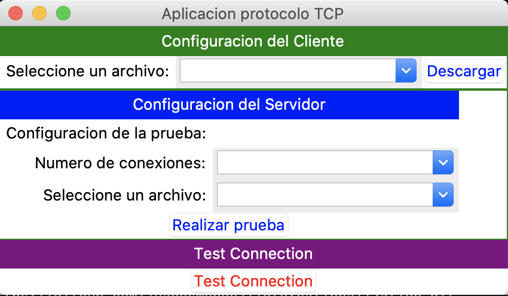

# TCP File Transfer Client 📂🗄🗃

## Description

TCP client implemented in Python 🐍 in which the user can download files from a server. The server can be found in the following repository: https://github.com/juanesmendez/tcp-server. The app has a GUI, where the user can pick the file that he wishes to download. The app can simulate having more than one client connected at the same time to the server, in order to test how well the server performs under high demand, and how it can handle concurrency. The client checks the integrity of the file received by calculating a hash digest on the byte stream, and comparing it to the hash digest sent by the server in the header.

### Python libraries 📚

The following python libraries and classes were used in the client application:
- `socket`
- `sys` 🛠
- `pickle`🥒: For receiving the byte chunks from the server.
- `hashlib` 🔑#️⃣: For calculating the hash digest of the file that is transferred to the client.
- `time`⏳
- `datetime` 📆
- `threading`
- `concurrent.futures`
- `tkinter`: Library that offers GUI components in Python 🐍.
- `random` 

## Screenshots of the client running

## How to run the project?

In order to run the project successfully, you first have to download and run the server. which you can find it in the following repo: https://github.com/juanesmendez/tcp-server. Follow the instructions in the README.md in the repository to run the server successfully. After launching the server application, follow the instructions below:

1. Download `Python 3.7`
2. Change line #16 in the `client.py` file with the `IP address` of the computer where your server is running.
    - Example: `IP = "3.228.188.119"`
    - NOTE: You may change the `port` if you want in line #17. The default chosen by me was `1236`. (Check that the server is running in the port you chose)
3. Run `python3.7 main.py`
4. Pick a file 📁 to download from the dropdown, and enjoy!☕️ (Have in mind that you can only download files that are in the `server` project directory. Locate the files you want users to be able to download in the server first.) 

